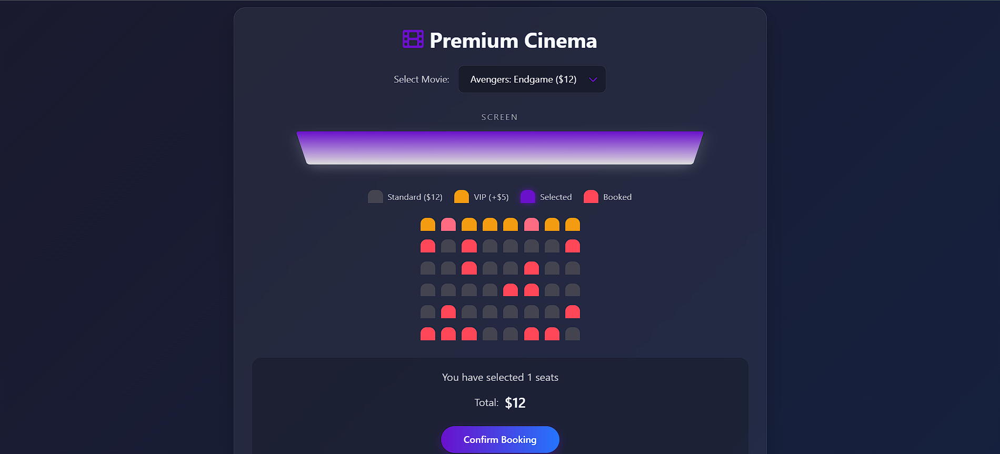

# Movie Seat Booking System



## Table of Contents
- [Introduction](#introduction)
- [Features](#features)
- [Demo](#demo)
- [Installation](#installation)
- [Usage](#usage)
- [Technologies Used](#technologies-used)
- [Project Structure](#project-structure)
- [Contributing](#contributing)
- [License](#license)
- [Connect with Me](#connect-with-me)

## Introduction

This is a professional movie seat booking application built with HTML, CSS, and JavaScript. The application allows users to:
- Select from available movies
- View seat availability in a theater-style layout
- Select available seats
- See real-time price calculation
- Complete bookings with visual confirmation

The project showcases modern frontend development techniques including:
- Dynamic DOM manipulation
- LocalStorage for persistent data
- CSS animations and transitions
- Responsive design principles

## Features

### Core Functionality
- 🎬 Movie selection with price variations
- 💺 Interactive seat map with visual status indicators
  - Available seats
  - Selected seats
  - VIP seats (premium pricing)
  - Occupied/booked seats
- 💰 Real-time price calculation
- 📦 LocalStorage persistence for:
  - Selected movie
  - Booked seats
  - User selections

### Enhanced User Experience
- ✨ Animated screen with color transitions
- 🎉 Confetti celebration on successful booking
- 📱 Fully responsive design
- 🔔 Notification system for user feedback
- 🛑 Disabled states for invalid actions
- 🔄 Dynamic seat generation

### Professional UI Elements
- 🎨 Modern glassmorphism design
- 🖱️ Hover effects and interactive elements
- 📊 Visual seat legend
- 🔄 Smooth transitions and animations

## Installation

To run this project locally:

1. Clone the repository:
```bash
git clone https://github.com/Spoidarman/movie-seat-booking.git
```

2. Navigate to the project directory:
```bash
cd movie-seat-booking
```

3. Open the index.html file in your browser:
```bash
open index.html  # On Mac
start index.html # On Windows
```

Alternatively, you can use a local server like Live Server in VS Code.

## Usage

1. **Select a Movie**:
   - Choose from the dropdown menu
   - Notice the price changes based on selection

2. **Select Seats**:
   - Click on available seats to select them
   - VIP seats are gold-colored and cost $5 extra
   - Occupied seats (red) cannot be selected

3. **View Booking Summary**:
   - The bottom panel shows:
     - Number of selected seats
     - Total price

4. **Complete Booking**:
   - Click "Confirm Booking" button
   - Watch the confetti celebration!
   - Selected seats will become occupied

## Technologies Used

### Frontend
- **HTML5**: Semantic structure
- **CSS3**:
  - Flexbox and Grid layout
  - Custom properties (variables)
  - Animations and transitions
  - Glassmorphism design
- **JavaScript**:
  - DOM manipulation
  - Event handling
  - LocalStorage API

### Tools
- **Font Awesome**: For icons
- **Google Fonts**: Typography
- **Git**: Version control

## Project Structure

```
movie-seat-booking/
├── index.html          # Main HTML file
├── README.md           # Project documentation
├── style.css       # External CSS (if separated)
└── script.js       # External JavaScript (if separated)
```

## Contributing

Contributions are welcome! Here's how you can help:

1. Fork the project
2. Create your feature branch (`git checkout -b feature/AmazingFeature`)
3. Commit your changes (`git commit -m 'Add some AmazingFeature'`)
4. Push to the branch (`git push origin feature/AmazingFeature`)
5. Open a Pull Request

Please make sure to update tests as appropriate.

## License

Distributed under the MIT License. See `LICENSE` for more information.

## Connect with Me

Let's connect and collaborate!

- GitHub: [https://github.com/Spoidarman](https://github.com/Spoidarman)
- LinkedIn: [https://www.linkedin.com/in/moinak-kuila-589a72227/](https://www.linkedin.com/in/moinak-kuila-589a72227/)
- Portfolio: [https://www.linkedin.com/in/moinak-kuila-589a72227/](https://www.linkedin.com/in/moinak-kuila-589a72227/)
- Email: *kuilamoinak3@gmail.com*

---

**Happy Coding!** 🚀
